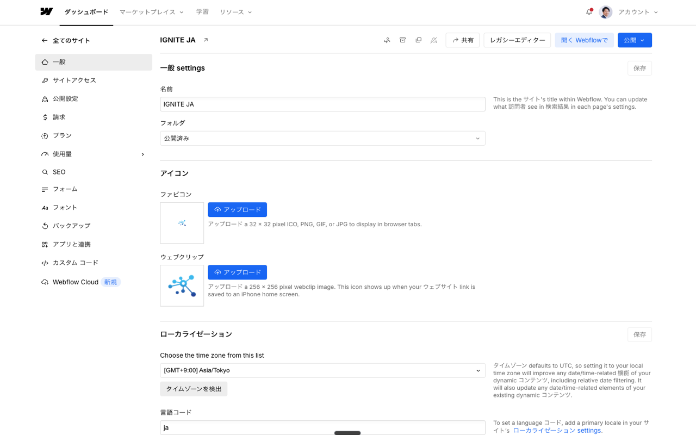

# Webflow管理画面日本語化 Chrome拡張機能

[](https://chromewebstore.google.com/detail/webflow-日本語化/efenpjcceehojemnphkinocffloghhon)


## 概要

Webflowの管理画面（Designer/Editor等）の英語UIを、CSVで管理する用語集に基づき日本語化するChrome拡張機能です。

- 英語UIテキストを部分的に日本語へ自動置換
- 用語集（CSV）は自由に編集・拡張可能
- オプションページで用語集一覧・部分置換プレビューが可能
- **ポップアップUIで翻訳のON/OFF切り替えが可能**

## スクリーンショット

| Designer画面 | Dashboard画面 |
|:---:|:---:|
|  |  |

## インストール方法

### Chrome Web Store（推奨）

[Chrome Web Storeからインストール](https://chromewebstore.google.com/detail/webflow-日本語化/efenpjcceehojemnphkinocffloghhon)

### 開発者向け（手動インストール）

1. このリポジトリをダウンロードまたはクローンします。
2. Chromeの `chrome://extensions/` を開き、「デベロッパーモード」をONにします。
3. 「パッケージ化されていない拡張機能を読み込む」から本フォルダ（webflow-ja-extension）を選択します。
4. Webflowの管理画面を開き、日本語化が反映されているかご確認ください。

## 使い方

- Webflowの管理画面（*.webflow.com）にアクセスすると、自動で日本語化が適用されます。
- **ポップアップUI**: ツールバーの拡張機能アイコンをクリックすると、翻訳のON/OFFを切り替えられます。
- オプションページ（拡張機能の「詳細」→「オプション」）で、用語集の一覧や部分置換プレビューが利用できます。

## 翻訳用語集（CSV）の更新方法

- `translation_terms.csv` を直接編集し、英語-日本語のペアを追加・修正してください。
- 編集後、拡張機能を「再読み込み」すると新しい翻訳が反映されます。
- Googleスプレッドシート等で管理→CSVエクスポート→上書きも可能です。

## 開発者向け情報

### GitHub Actions自動デプロイ

このリポジトリはGitHub Actionsを使用して、タグをプッシュすると自動的にChrome Web Storeへ公開されます。

#### 設定手順

1. **Google Cloud Console設定**
   - [Google Cloud Console](https://console.cloud.google.com/)でプロジェクトを作成
   - Chrome Web Store APIを有効化
   - OAuth 2.0クライアントIDを作成（デスクトップアプリ）

2. **Refresh Token取得**

   以下のURLにアクセスしてauthorization codeを取得:
   ```
   https://accounts.google.com/o/oauth2/auth?response_type=code&scope=https://www.googleapis.com/auth/chromewebstore&client_id=YOUR_CLIENT_ID&redirect_uri=urn:ietf:wg:oauth:2.0:oob
   ```

   codeを使ってRefresh Tokenを取得:
   ```bash
   curl -X POST https://oauth2.googleapis.com/token \
     -d code=YOUR_AUTH_CODE \
     -d client_id=YOUR_CLIENT_ID \
     -d client_secret=YOUR_CLIENT_SECRET \
     -d redirect_uri=urn:ietf:wg:oauth:2.0:oob \
     -d grant_type=authorization_code
   ```

3. **GitHub Secrets設定**

   リポジトリのSettings → Secrets and variables → Actionsで以下を設定:
   - `CHROME_EXTENSION_ID`: `efenpjcceehojemnphkinocffloghhon`
   - `CHROME_CLIENT_ID`: Google CloudのClient ID
   - `CHROME_CLIENT_SECRET`: Google CloudのClient Secret
   - `CHROME_REFRESH_TOKEN`: 取得したRefresh Token

4. **デプロイ実行**
   ```bash
   git tag v1.0.3
   git push origin v1.0.3
   ```

### ディレクトリ構成

```
webflow-ja-extension/
├── manifest.json          # 拡張機能マニフェスト
├── content.js             # 翻訳エンジン
├── translation_terms.csv  # 翻訳用語集（2,104件）
├── options.html/js        # オプションページ
├── popup.html/js/css      # ポップアップUI
├── utils.js               # 共通ユーティリティ
├── icons/                 # 拡張機能アイコン
└── store-assets/          # Chrome Web Store用画像
```

## ライセンス

MIT License
